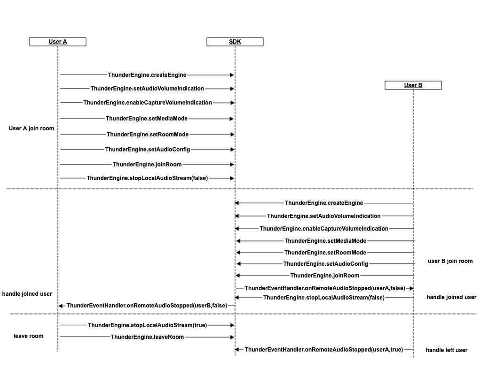

## 音频开播
[中文](README.zh.md) | [English](README.md)

该Demo演示了如何快速集成聚联云SDK，实现音频开播。包含了以下功能：
- 加入/离开房间
- 开播音质设置
- 扬声器和听筒切换
- 开/关麦克风
- 切换前置/后置摄像头
- 开/关耳返
- 变声


### API调用流程图


### API说明

（1）初始化ThunderSDK
```
    thunderEngine = ThunderEngine.createEngine(context, appId, sceneId, handler);
```
（2）启用说话者音量提示，打开采集音量回调
```
    //启用说话者音量提示
    thunderEngine.setAudioVolumeIndication(interval, moreThanThd, lessThanThd, smooth);
    //打开采集音量回调
    thunderEngine.enableCaptureVolumeIndication(interval, moreThanThd, lessThanThd, smooth);
   
```
（3）设置SDK媒体模式，设置房间场景模式，设置音频配置
```
    //设置sdk媒体模式
    thunderEngine.setMediaMode(mode);
    //设置房间场景模式
    thunderEngine.setRoomMode(mode)
    //设置音频配置
    thunderEngine.setAudioConfig(profile, commutMode, scenarioMode)

```
（4）加入房间
```
    thunderEngine.joinRoom(token, roomId, uid);
    thunderEngine.stopLocalAudioStream(false);
```

（5）离开房间
```
   thunderEngine.stopLocalAudioStream(true);
   thunderEngine.leaveRoom();
```
（6）设置开播音质设置
```
   thunderEngine.setAudioConfig(profile, commutMode, scenarioMode);
```
（7）扬声器和听筒切换
```
   thunderEngine.enableLoudspeaker(enabled);
```
（8）开/关音频采集与推流
```
   thunderEngine.stopLocalAudioStream(stop);
```
（9）开/关耳返
```
   thunderEngine.setEnableInEarMonitor(enabled);
```
（10）变声
```
    thunderEngine.setVoiceChanger(mode);
```