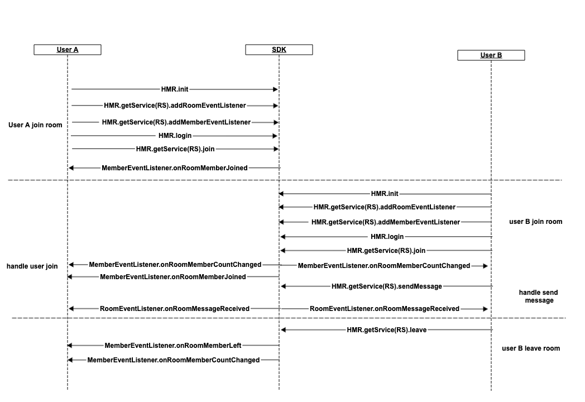

## Chatroom
[中文](README.zh.md) | [English](README.md)

 This Demo demonstrates how to quickly integrate Jocloud SDK to implement the voice chat in a room. 
With this demo you can perform the following functions:
Join/exit a room
Send message
Listen for room status or messages
Listen for the member status

### API Calling Flow


## API Details 

(1)Initialize HMR
```
    HMR.init(context, appId, appVersion, listener)
```
 
(2)Login
```
   HMR.login(uid, region, token, completion);
```
(3)Logout
 ```
   HMR.logout();
 ```
(4)Add or remove listener for room attributes or messages
```
    //add
     HMR.getService(RoomService.class).addRoomEventListener(listener);

     //remove
     HMR.getService(RoomService.class).removeRoomEventListener(listener);
```
(5)Add or remove listener for member events, such as changes in attributes or total members, joining/exiting a room
```
    //add
    HMR.getService(RoomService.class).addMemberEventListener(listener);

    //remove
    HMR.getService(RoomService.class).removeMemberEventListener(listener);
```
(6)Join a room
```
   HMR.getService(RoomService.class).join(roomId, map, roomJoiningOptions, completion);
```

(7)Exit a room
```
 HMR.getSrvice(RoomService.class).leave(roomId, completion);
```
(8)Send messages
```
 HMR.getService(RoomService.class).sendMessage(roomId, message, options, completion);
```
(9)Search for members
```
 HMR.getService(RoomService.class).queryMembers(roomId, completion);
```