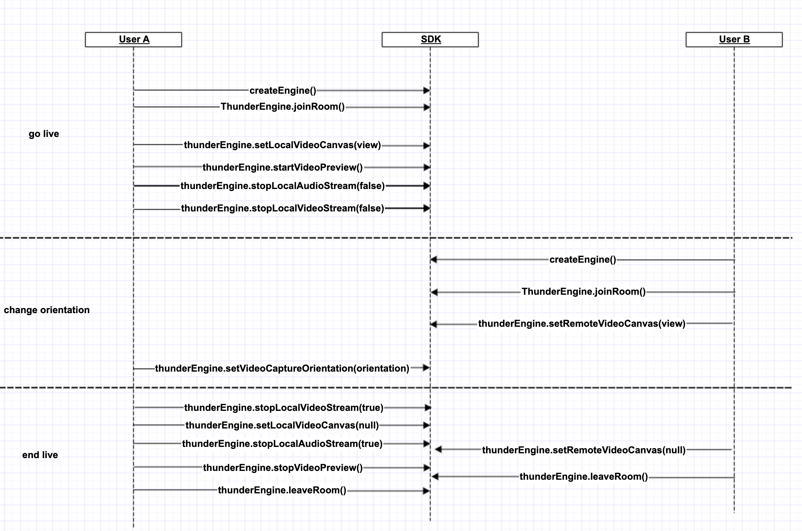

## Video Publishing
[中文](README.zh.md) | [English](README.md)

## 1.Overview
Set Video Position (Portrait/Landscape)
Set Render Mode
Set Mirror Mode
Turn On/Off the Camera
Set Video Quality
Switch Front/Rear Camera



## 2.API Calling Flow

### 2.1 Start Publishing

```objc
    //setRoomConfig
    thunderEngine.setMediaMode(mediaMode);
    thunderEngine.setRoomMode(roomMode);
    //joinRoom
    thunderEngine.joinRoom(token, roomId, uid);
    thunderEngine.setLocalVideoCanvas(mPreviewView);
    thunderEngine.setLocalCanvasScaleMode(ThunderVideoRenderMode);
    //push
    thunderEngine.startVideoPreview();
    thunderEngine.stopLocalAudioStream(false);
    thunderEngine.stopLocalVideoStream(false);
```

### 2.2 Stop Publishing

```objc
    thunderEngine.stopLocalVideoStream(true);
    thunderEngine.stopLocalAudioStream(true);
    thunderEngine.stopVideoPreview();
    thunderEngine.setLocalVideoCanvas(null);
    thunderEngine.setRemoteVideoCanvas(null);
    thunderEngine.leaveRoom();
```

### 2.3 Set Video Position (Portrait/Landscape)

```objc
    thunderEngine.setVideoCaptureOrientation(orientation);
```

### 2.4 Mirror

```objc
    thunderEngine.setLocalVideoMirrorMode(mirrorMode);
```

### 2.5 Set Video Quality

```objc
    thunderEngine.setVideoEncoderConfig(ThunderVideoEncoderConfiguration);
```


### 2.6 Front/Rear Camera

```objc
    thunderEngine.switchFrontCamera(bFront);
```

### 2.7 Camera On/Off

```objc
    thunderEngine.enableLocalVideoCapture(false);
    thunderEngine.stopLocalVideoStream(isStop);
```

### 2.8 Switch audio acquisition and push stream

```objc
    thunderEngine.stopLocalAudioStream(isStop);
```

### 2.9 Render Mode

```objc
    thunderEngine.setLocalCanvasScaleMode(ThunderVideoRenderMode);
    thunderEngine.setRemoteCanvasScaleMode(UID,ThunderVideoRenderMode);
```