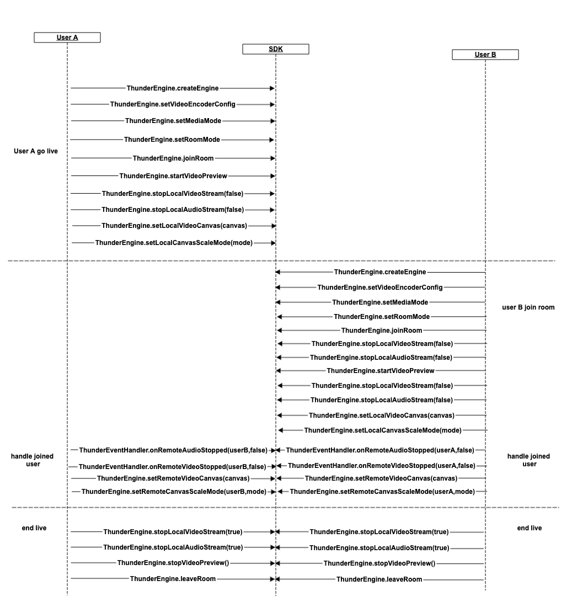

## 同房间多人连麦
[中文](README.zh.md) | [English](README.md)

该Demo演示了如何快速集成聚联云SDK，实现同房间多人连麦。包含了以下功能：
- 加入/离开房间
- 开/关麦
- 开/关摄像头
- 切换前置/后置摄像头
- 记录日志信息
- 放大/还原视图


> 集成SDK到APP，请参考：[SDK集成方法](https://docs.jocloud.com/cloud/cn/product_category/rtc_service/rt_video_interaction/integration_and_start/integration_and_start_ios.html)

> API开发手册，请访问： [Android API](https://docs.jocloud.com/cloud/cn/product_category/rtc_service/rt_video_interaction/api/iOS/v2.8.0/category.html)

### API调用流程图


### API说明

（1）初始化ThunderSDK
 ```
    thunderEngine = ThunderEngine.createEngine(context, appId, sceneId, handler);
```
 
（2）设置开播视频的编码配置，设置媒体模式，设置房间场景模式
```
    //设置开播视频的编码配置
    ThunderVideoEncoderConfiguration configuration = new ThunderVideoEncoderConfiguration();
    configuration.publishMode = RtcConstant.getPublishMode(context);
    configuration.playType = ThunderRtcConstant.ThunderPublishPlayType.THUNDERPUBLISH_PLAY_INTERACT;
    thunderEngine.setVideoEncoderConfig(configuration);
    //设置媒体模式
    thunderEngine.setMediaMode(ThunderRtcConstant.ThunderRtcProfile.THUNDER_PROFILE_DEFAULT);
    
    //设置房间场景模式
    thunderEngine.setRoomMode(ThunderRtcConstant.RoomConfig.THUNDER_ROOMCONFIG_LIVE);
```

（3）加入房间 从业务服务器获取[token接入方法](https://docs.jocloud.com/cloud/cn/platform/restful_api/http_auth/http_auth
.html)
```
    thunderEngine.joinRoom(token, roomId, uid);

    //开启本机摄像头视频预览
    thunderEngine.startVideoPreview();
    
    //开始推送本地视频流
    result = thunderEngine.stopLocalVideoStream(false);

    //开始推送本地音频流
    result = thunderEngine.stopLocalAudioStream(false);

    //设置本地预览view  
    thunderEngine.setLocalVideoCanvas(canvas);
    thunderEngine.setLocalCanvasScaleMode(mode);
```

（4）离开房间
```	
    //停止推送本地音频流
    thunderEngine.stopLocalAudioStream(true);
    //停止推送本地视频流
    thunderEngine.stopLocalVideoStream(true);
    //关闭预览
    thunderEngine.stopVideoPreview();
    
    thunderEngine.leaveRoom();
```

（5）加入房间成功回调，离开房间回调
```
    @Override
    public void onJoinRoomSuccess(String room, String uid, int elapsed) {
        super.onJoinRoomSuccess(room, uid, elapsed);
    }
    
    @Override
    public void onLeaveRoom(ThunderEventHandler.RoomStats status) {
        super.onLeaveRoom(status);
    }  
```

（6）远端音频、视频流回调通知（当有音频或视频加入房间时表示远端加入房间，如果音频与视频都关闭则为远端关播）
```
    @Override
    public void onRemoteAudioStopped(String uid, boolean stop) {
        super.onRemoteAudioStopped(uid, stop);
    }
     
    @Override
    public void onRemoteVideoStopped(String uid, boolean stop) {
        super.onRemoteVideoStopped(uid, stop);
    }   
```
（7）远端视频展示
```
    thunderEngine.setRemoteVideoCanvas(canvas);
    thunderEngine.setRemoteCanvasScaleMode(uid,mode);
```

（8）打开/关闭摄像头
```
    //打开摄像头
    thunderEngine.startVideoPreview();
    thunderEngine.stopLocalVideoStream(false);
    
    //关闭摄像头
    thunderEngine.stopVideoPreview();
    thunderEngine.stopLocalVideoStream(true);
```

（9）打开/关闭麦克风
```
     //打开麦克风
     thunderEngine.stopLocalAudioStream(false);
     
     //关闭麦克风
     thunderEngine.stopLocalAudioStream(true);
```
（10）切换前后置摄像头
```
     thunderEngine.switchFrontCamera(bFront);
```

（11）接收/关闭远端音频、视频流
```
    //接收/关闭远端音频流
    thunderEngine.stopRemoteAudioStream(uid, stop);

    //接收/关闭远端视频流
    thunderEngine.stopRemoteVideoStream(uid, stop);
```