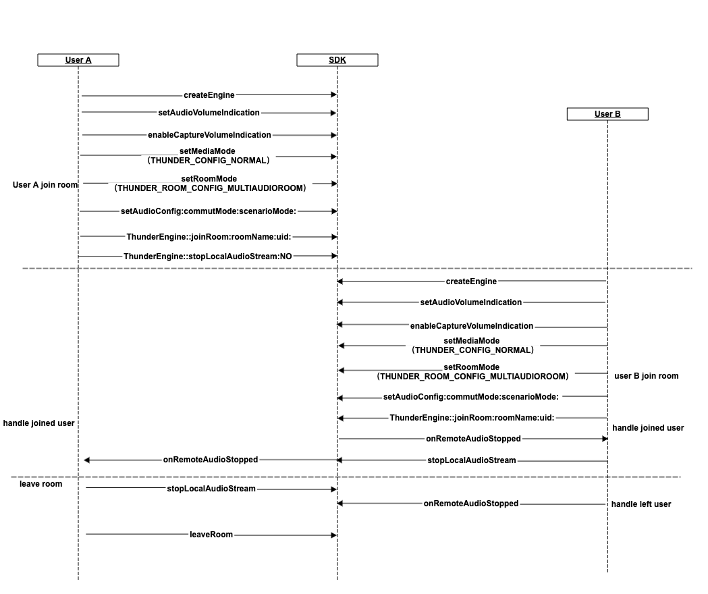

## Audio Publishing
*[简体中文](audio_README.zh.md) | [English](audio_README.md)*

This Demo demonstrates how to quickly integrate Julian Cloud SDK to achieve audio publishing. The following functions
 are included:
- Join/Leave Room
- Audio config settings
- Speaker and earphone switching
- Turn on/off microphone
- Turn on/off ear monitor
- Voice changer

> Integrate SDK to APP, please refer to: [SDK Integration Method](http://test-docs.jocloud.com/cloud/en/product_category/rtc_service/rt_audio_interaction/integration_and_start/integration_and_start_ios.html)

> API development manual, refer to: [iOS API](http://test-docs.jocloud.com/cloud/en/product_category/rtc_service/rt_audio_interaction/api/iOS/v2.9.12/category.html)

### API Call process


### API Details 

(1)Initialize Thunder SDK

```objc
     self.thunderEngine = [ThunderEngine createEngine:appId sceneId:sceneId delegate:delegate];
```

(2)Enable speaker volume prompt, turn on collection volume callback

```objc
    [self.thunderEngine setAudioVolumeIndication:interval moreThanThd:0 lessThanThd:0 smooth:0]
    [self.thunderEngine enableCaptureVolumeIndication:interval moreThanThd:0 lessThanThd:0 smooth:0];
```

(3)Set media mode, set room scene mode, set audio configuration

```objc
   [self.thunderEngine setRoomConfig:THUNDER_CONFIG_ONLY_AUDIO roomConfig:THUNDER_ROOM_CONFIG_MULTIAUDIOROOM];
   [self.thunderEngine setMediaMode:mediaMode];
   [self.thunderEngine setRoomMode:roomMode];
   [self.thunderEngine setAudioConfig:config commutMode:commutMode scenarioMode:scenarioMode]
```

(4)Join room

```objc
   [self.thunderEngine joinRoom:@"" roomName:self.modulesManager.crossLocalRoomId uid:self.modulesManager.crossLocalUid];
   [self.thunderEngine stopLocalAudioStream:NO];
```

(5)leave room

```objc
   [self.thunderEngine stopLocalAudioStream:YES];
   [self.thunderEngine leaveRoom];
```

(6)Set audio config settings

```objc
   [self.thunderEngine setAudioConfig:self.audioConfig commutMode:THUNDER_COMMUT_MODE_HIGH scenarioMode:THUNDER_SCENARIO_MODE_DEFAULT];
```

(7)Speaker and earphone switching

```objc
   [self.thunderEngine enableLoudspeaker:enableSpeaker];
```

(8)Turn on/off microphone

```objc
    [self.thunderEngine stopLocalAudioStream:stopped];
```

(9)Turn on/off ear monitor

```objc
   [self.thunderEngine setEnableInEarMonitor:enabled];
```

(10)Voice changer

```objc
   [self.thunderEngine setVoiceChanger:(int)mode];
```
