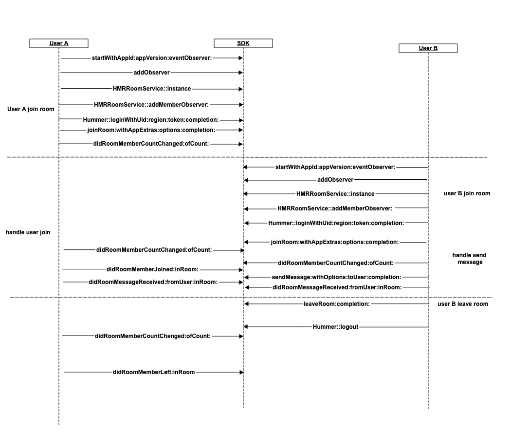

## Chat room
*[简体中文](chat_room_README.zh.md) | [English](chat_room_README.md)*

This Demo demonstrates how to quickly integrate Julian Cloud SDK to achieve the same room chat room function. The following functions are included:
- Join/exit a room
- Send message
- Monitor room status, messages
- Monitor the room members entering/leaving, the member status changes

> Integrate SDK to APP, please refer to: [SDK Integration Method](http://test-docs.jocloud.com/cloud/en/product_category/rtm_service/instant_messaging/integration_and_start/integration_and_start_ios.html)

> API development manual, refer to: [iOS API](http://test-docs.jocloud.com/cloud/en/product_category/rtm_service/instant_messaging/api/iOS/v3.1.3/category.html)

### API Calling Flow


## API Details 

(1)Init HMR

```objc
// appId AppId signed and issued by the service platform for the application developer
// appVersion Version of current application
// self Event listener that should comply with the HMREventObserver protocol
[Hummer startWithAppId:appId appVersion:appVersion eventObserver:self];
```

(2)Login

```objc
    [Hummer loginWithUid:uid region:region token:token completion:completion];
```

(3)Logout

```objc
    [Hummer logout];
```

(4)Add or remove monitoring room attributes, messages

```objc
    [[HMRRoomService instance] addRoomObserver:observer];
    [[HMRRoomService instance] removeRoomObserver:observer];
```

(5)Add or remove the attributes of members in the monitoring room, join/leave, the total number of people changes

```objc
    [[HMRRoomService instance] addMemberObserver:observer];
    [[HMRRoomService instance] removeMemberObserver:observer];
```

(6)Join room

```objc
   HMRRoomId *roomid = [HMRRoomId roomWithID:roomId];
   [[HMRRoomService instance] joinRoom:roomid withAppExtras:nil options:nil completion:completion];
```

(7)Leave room

```objc
   HMRRoomId *roomid = [HMRRoomId roomWithID:roomId];
   [[HMRRoomService instance]leaveRoom:roomid completion:completion];
```

(8)Send message

```objc
   NSData *data = [content dataUsingEncoding:NSUTF8StringEncoding];
   HMRMessage *message = [HMRMessage messageWithType:nil content:data appExtras:nil];
   HMRRoomId *roomid = [HMRRoomId roomWithID:roomId];
   [[HMRRoomService instance] sendMessage:message withOptions:nil inRoom:roomid completion:^(HMRRequestId reqId, NSError *error) {
        if (error) {
            completionHandler(error);
        } else {
            completionHandler(nil);
        }
    }];
```
(9)query room members

```objc
   HMRRoomId *roomid = [HMRRoomId roomWithID:roomId];
   [[HMRRoomService instance] queryMembers:roomid completion:completion];
```